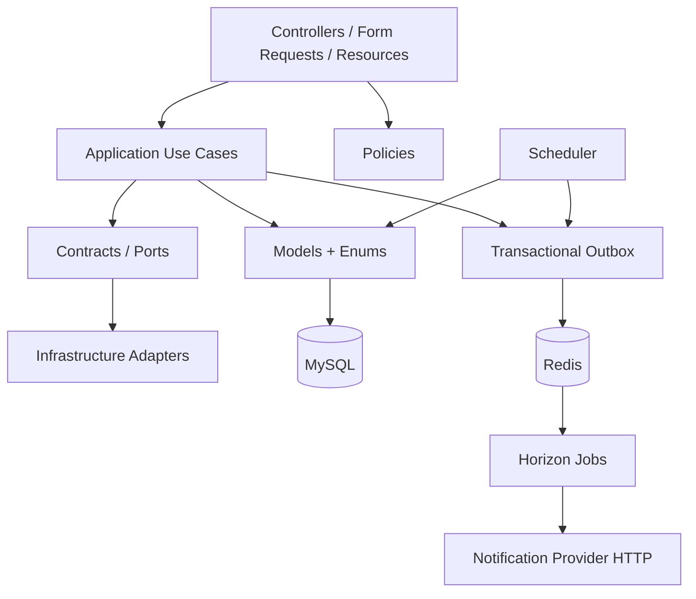

# DECISIONS

Este arquivo responde diretamente às quatro perguntas obrigatórias do desafio. Detalhes arquiteturais e alternativas estão nos ADRs.

## 0. Arquitetura escolhida e organização do código

Escolhi um **monólito modular Laravel** para a API principal, com processamento assíncrono para efeitos externos. A razão é a fronteira de consistência: reservar, confirmar, cancelar e reemitir mexem em `Seat`, `Reservation`, `Order` e `Ticket`, e neste desafio essas invariantes ficam mais simples e confiáveis quando permanecem na mesma transação MySQL. Separar esses componentes em microserviços agora obrigaria coordenação distribuída/sagas sem benefício proporcional para o escopo.

A organização é **inspirada em Clean Architecture**, não uma implementação dogmática. Controllers recebem/retornam HTTP; Form Requests validam entrada; Policies cuidam de autorização; classes em `Application/*` concentram os casos de uso; `Contracts/*` define portas para dependências substituíveis; `Infrastructure/*` contém adapters concretos; Models/Enums representam persistência e estados do domínio; Jobs/Commands/Scheduler executam processamento assíncrono e manutenção.



Princípios/patterns usados de forma intencional:

- **SRP / casos de uso explícitos:** `ReserveSeats`, `ConfirmPurchase`, `CancelOrder` e `ReissueTicket` evitam Controllers com regra de negócio extensa.
- **Dependency Inversion / Ports & Adapters seletivo:** `NotificationProvider` e `EventSearch` desacoplam os pontos externos que podem variar.
- **Strategy:** busca é consumida por contrato e atualmente usa `MysqlEventSearch`; outro mecanismo pode substituir esse adapter.
- **Transactional Outbox:** intenção de notificação é persistida no mesmo commit da compra.
- **Idempotent Consumer:** retries/redelivery da fila não devem produzir uma segunda entrega lógica nem um segundo Ticket.
- **Pessimistic Locking:** `SELECT ... FOR UPDATE` protege a disputa de Seats na fonte de verdade.
- **Retry + Backoff:** falhas transitórias do provider são tratadas fora da request de checkout.
- **Policy:** autorização por papel + ownership fica centralizada nas Policies do Laravel.
- **Append-only Audit Trail:** alterações relevantes permanecem rastreáveis sem armazenar CPF no histórico.

Também houve decisões conscientes sobre o que **não** adicionar. Não criei Repository genérico sobre Eloquent, CQRS, Event Sourcing, Kafka ou microserviços apenas para aumentar o número de padrões. Para o volume e requisitos atuais, isso aumentaria complexidade acidental. As fronteiras foram criadas onde há motivo real para substituição ou falha independente.

### Runtime resumido

```text
Cliente/k6 -> Nginx -> PHP-FPM/Laravel -> MySQL
                                  \\-> Redis -> Horizon -> Notification Provider
                         Scheduler -> Outbox / expiração / alertas
                         Pulse + Horizon -> observabilidade local
```

### Stack principal

| Área | Tecnologia |
|---|---|
| API | PHP 8.4 + Laravel 13 |
| HTTP | Nginx + PHP-FPM |
| Banco | MySQL 8.4 |
| Queue/cache | Redis 7 |
| Workers | Laravel Horizon |
| Observabilidade | Laravel Pulse + Horizon + métricas próprias |
| Autenticação | Laravel Sanctum |
| Testes | PHPUnit 12 + k6 |
| Infra local | Docker Compose + Make/Bash |
| Serviço externo simulado | PHP 8.4 em container próprio, via HTTP interno |

## 1. Como garanti que o mesmo assento não pode ser vendido duas vezes, e o que me faria confiar nisso em produção?

MySQL é a fonte de verdade. `ReserveSeats` ordena os IDs dos assentos e executa `SELECT ... FOR UPDATE` apenas nas linhas disputadas. Validação, criação de `reservations`/`reservation_items` e transição dos Seats para `reserved` acontecem na mesma transação. Se um dos assentos estiver indisponível, toda a operação faz rollback (all-or-nothing).

A ordenação determinística reduz deadlocks e `DB::transaction(..., 3)` permite retry de deadlock. Não uso Redis lock como autoridade do assento: com várias instâncias de API, todas convergem para o mesmo lock/constraints do MySQL.

A correção também não depende do cron: um hold expirado pode ser retomado dentro da nova transação. Na confirmação, Reservation e Seats são novamente travados e cada Seat precisa continuar com a mesma `reservation_id` e TTL válido. Assim uma reserva antiga não confirma um assento que já foi retomado.

Constraints complementam o lock: posição física do Seat é única por evento/setor/fileira/número, `orders.reservation_id` é único e o código de Ticket é único.

O que me faria confiar em produção: testes de integração usando o mesmo MySQL, teste de carga repetível com 50 requests/10 seats, métricas de conflitos/deadlocks, observação de p95/p99 e execução da mesma estratégia com múltiplas réplicas da API contra o mesmo banco. `make load-test` exige 10 sucessos, 40 conflitos, 0 respostas inesperadas e valida zero duplicidade via SQL.

## 2. Como tratei a instabilidade do provedor (falha, demora, duplicidade) e por que escolhi essa abordagem?

`Order`, `Ticket(s)`, `OutboxEvent` e `NotificationDelivery` nascem no mesmo commit. O endpoint de confirmação não faz HTTP para o provider. Isso evita manter lock/transação aberta por dependência externa e evita que uma queda do provider transforme checkout em indisponibilidade.

Depois do commit, o Scheduler publica a Outbox em Redis e o Horizon executa `SendTicketNotification`. O client usa connect timeout 1s, timeout 2s, 5 tentativas e backoff 5/15/30/60s. A entrega é **at-least-once**, não exactly-once.

Cada delivery possui `notification_id` estável enviado como `Idempotency-Key`. O provider simulado deduplica retries já aceitos. Ainda existe a janela clássica em que o provider aceita e o processo cai antes de persistir `sent`; por isso a idempotência no destino é parte da garantia e eu não prometo exactly-once.

`NotificationDelivery` preserva `attempts`, último erro, status HTTP e timestamps. Assim uma falha nunca some silenciosamente.

## 3. O que acontece quando o provedor fica indisponível por um período mais longo, e por que reagi assim?

A compra continua `confirmed` e o Ticket permanece válido. O provider pode estar em `slow`, `error`, `down` ou até com o container parado; novas compras não aguardam essa dependência.

Enquanto houver tentativas, Horizon aplica retry/backoff. Depois de esgotar as 5, a Delivery vira `failed`. Esse estado aparece em Horizon, banco e `/api/ops/metrics`; Pulse também ajuda a observar requests externos lentos/erros.

Quando o provider volta, `php artisan notifications:retry-failed` (ou `--id=`) coloca a delivery em `pending` e reenfileira o mesmo evento, sem criar novo Order/Ticket e sem zerar o histórico de tentativas.

Escolhi manter a compra confirmada porque a verdade do negócio (assento vendido/Ticket emitido) não deve depender da disponibilidade de um efeito externo recuperável. Reverter venda por falha de notificação criaria um problema de consistência maior e uma experiência ruim para o comprador.

## 4. Se usei IA, em qual parte e como revisei a lógica como em um code review?

Usei IA como apoio para: discutir alternativas de concorrência, gerar esqueletos iniciais de migrations/use cases/tests, estruturar o provider instável e revisar documentação/ADRs. Não tratei a saída como pronta.

Exemplo concreto de revisão do fluxo de reserva: o esqueleto foi ajustado para ordenar IDs antes do lock, travar somente Seats (não a linha inteira de Event), manter a transação curta, fazer all-or-nothing e permitir reclaim de hold expirado sem depender do Scheduler. Também mantive MySQL como autoridade e descartei Redis lock como garantia primária.

No fluxo de confirmação, revisei para que `Order + Tickets + Outbox + Delivery` sejam atômicos e para que nenhum HTTP aconteça dentro do commit. Adicionei revalidação de `reservation_id`/TTL dos Seats sob lock, `UNIQUE reservation_id` no Order, tratamento de idempotência e CPF cifrado/fora de logs e eventos.

Na notificação, revisei a promessa de entrega: removi qualquer interpretação de exactly-once e assumi at-least-once + idempotência. O provider usa `notification_id` estável, retries são limitados e a falha final é persistida/reprocessável.

Também corrigi problemas encontrados durante a revisão do projeto final, como não usar `php artisan serve` para evidência de concorrência (Nginx + PHP-FPM), tornar `docker compose up` autossuficiente e eliminar um índice duplicado que faria uma migration nova falhar.

Antes da entrega, o código gerado/alterado por IA é tratado como qualquer contribuição: lint, testes automatizados, k6, resiliência e benchmark reproduzível (`make verify-delivery`).

---

## Decisões adicionais

### Cancelamento

Somente o buyer dono acessa/cancela a compra. Cancelamento trava o Order e os Seats, cancela Tickets, muda Order/Reservation para `cancelled` e libera Seat para `available` numa transação. Repetir cancelamento é idempotente.

### Reemissão e auditoria

Uma reemissão não cria um segundo Ticket para a mesma compra/seat. Ela trava Order/Ticket, rotaciona o código opaco e incrementa `version`. O audit trail append-only registra ator, entidade, versão anterior/nova e evento. Cancelamentos também são auditados.

### LGPD

CPF é requisito do Ticket, mas fica cifrado via cast `encrypted`, não é indexado e não entra em Outbox, logs, audit trail ou payload do provider. A API mascara o valor. O código/QR é um UUID opaco.

### Busca

A implementação local usa a interface `EventSearch` com driver MySQL. Filtros de nome/local são prefixos indexáveis e datas usam `starts_at`. `EVENT_SEARCH_AVAILABLE=false` simula indisponibilidade e retorna 503 apenas na busca; checkout continua.

### Relatório com 200 mil Tickets

`ReportBenchmarkSeeder` cria 200 mil Tickets e `reports:benchmark` mede o relatório local. O endpoint agrega no SQL e não materializa 200 mil models. Números de benchmark não são inventados; `make benchmark-report` grava o resultado real da máquina alvo.

### Alerta automático

`confirmation_attempts` registra resultado/duração. A cada minuto o Scheduler calcula taxa de falha em janela configurável; padrão: 5 min, mínimo 10 tentativas, alerta >=20%. `system_alerts` abre e resolve automaticamente.

### Observabilidade

Pulse acompanha requests/exceções/queries/jobs/requests externos lentos; Horizon acompanha filas/retries/falhas. `/api/ops/metrics` expõe backlog e failure rate localmente.

### 10x / 100x e regra de produto

10x: API stateless horizontal, MySQL/Redis gerenciados, workers por fila e read replicas/read models para leitura. O lock de assento continua correto entre instâncias porque está no MySQL compartilhado.

100x: waiting room/virtual queue, CDN/cache de catálogo, isolamento por evento quente, read models/aggregados, busca secundária reconstruível, filas gerenciadas e eventual particionamento por `event_id`. SQS serve bem jobs; Kafka só quando log/replay/múltiplos consumidores justificarem.

Melhoria de produto: fila virtual + limite de assentos por comprador + janela curta de checkout reduz disputa e abuso na origem sem enfraquecer a unicidade no banco.
