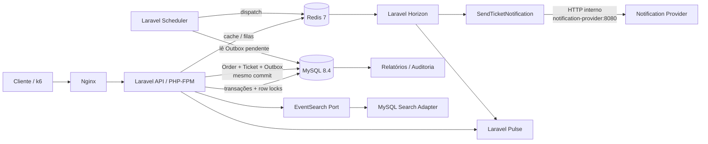
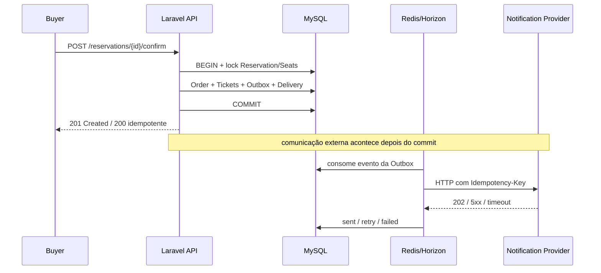

# Atlas Ticketing — Flash Sale com assentos numerados

API Laravel para venda de ingressos com assentos numerados sob alta concorrência. O projeto cobre as Fases 1 a 4 obrigatórias do desafio e implementa todos os diferenciais selecionados da Fase 5: relatório com 200 mil tickets, busca com milhares de eventos, alerta automático, auditoria, observabilidade local e desenho de escala 100x.

## 1. Quick start — exatamente como o avaliador deve subir

Pré-requisitos: Docker e Docker Compose. Não é necessário PHP, Composer, MySQL, Redis ou k6 instalados na máquina host.

Na raiz do repositório:

```bash
docker compose up -d --build
```

Para instalações antigas do Compose:

```bash
docker-compose up -d --build
```

Esse único comando sobe a stack e deixa a aplicação utilizável. O container `api` aguarda MySQL e Redis saudáveis, garante dependências Composer dentro da imagem, executa migrations, executa o seed baseline e inicia PHP-FPM. Nginx, Horizon e Scheduler sobem no mesmo `docker-compose.yml`.

A aplicação usa `docker/app.env`, já versionado para este ambiente local de avaliação. Não é necessário criar `api/.env`.

### O que sobe no Compose

| Serviço | Função | Acesso host |
|---|---|---|
| `nginx` | entrada HTTP da API | `http://localhost:8000` |
| `api` | Laravel + PHP-FPM | rede interna, porta 9000 |
| `mysql` | banco principal | `localhost:3307` |
| `redis` | filas/cache | `localhost:6379` |
| `horizon` | workers Redis | `http://localhost:8000/horizon` |
| `scheduler` | expiração, Outbox e monitoramento | interno |
| `notification-provider` | segundo serviço HTTP instável | `http://localhost:8081` |

Comunicação entre containers usa hostname de serviço Docker. A API chama o provider em:

```text
http://notification-provider:8080
```

Nunca usa `localhost` ou IP fixo para comunicação container→container.

### Migrations e seeds

`docker compose up -d --build` já executa automaticamente:

```text
php artisan migrate --force
php artisan db:seed --force
```

Se quiser executar manualmente depois:

```bash
make migrate
make seed
```

Usuários baseline:

```text
organizer@atlas.test / Password123!
buyer@atlas.test     / Password123!
```

## 1.1 Se já existe uma stack Atlas antiga na máquina

O `docker-compose.yml` não fixa `container_name`; o Compose gera os nomes a partir do projeto. Isso evita colisões globais entre clones/pastas diferentes. Ainda assim, uma stack antiga pode continuar ocupando as portas `8000`, `8081`, `3307` ou `6379`.

Antes de subir uma cópia nova, veja containers antigos:

```bash
docker ps -a --filter "name=atlas" --format "table {{.Names}}\t{{.Status}}\t{{.Ports}}"
```

Se forem containers descartáveis de uma execução anterior, remova-os sem apagar volumes:

```bash
docker rm -f atlas-api atlas-nginx atlas-horizon atlas-scheduler atlas-mysql atlas-redis atlas-notification-provider 2>/dev/null || true
```

Depois suba normalmente:

```bash
docker-compose up -d --build
```

Em uma máquina limpa do avaliador, esse passo de limpeza não é necessário.

## 2. Composer e pasta `vendor`

O runtime **não depende de `api/vendor` no host**. O Dockerfile copia o binário do Composer e executa `composer install` durante o build da imagem. Por isso, após subir a stack, é normal que a pasta `api/vendor` não exista na sua máquina.

Confirme que Composer e `vendor` existem dentro do container:

```bash
docker-compose exec api composer --version
docker-compose exec api test -f vendor/autoload.php && echo "vendor OK"
```

Ou execute a verificação completa:

```bash
make doctor
```

Se você quiser `api/vendor` fisicamente no host apenas para IDE/autocomplete, use:

```bash
make composer-host
```

`vendor/` continua no `.gitignore` e **não deve ser commitado**.

## 3. Verificação completa da entrega

Para os scripts auxiliares de verificação, além de Docker/Compose, a máquina deve ter `bash`, `make`, `curl` e `python3` (o k6 roda em container e não precisa ser instalado localmente).

`docker compose up` serve para subir a stack. Testes de carga e seeds de 200 mil tickets **não rodam automaticamente no startup**, porque são destrutivos/pesados e alteram bastante o banco. Eles ficam em um comando de verificação reproduzível.

Para subir a stack e executar tudo o que deve ser evidenciado antes do GitHub:

```bash
make verify-delivery
```

Antes ou durante essa verificação, `make namespace-check` valida o mapeamento PSR-4 (`App\` → `api/app`), imports internos e detecta padrões de namespace corrompidos. O comando também faz parte de `make verify-delivery`.

Esse comando executa, em ordem:

```text
1. build + startup de toda a stack
2. health/doctor da stack
3. PHPUnit das Fases 1–3 e extras
4. k6 com 50 compradores concorrentes / 10 assentos
5. validação SQL de 0 reserva/venda duplicada
6. modos do provider: normal/error/down/duplicate/slow
7. teste de outage + recuperação assíncrona
8. seed da Fase 5: 10.000 eventos + 200.000 tickets
9. benchmark do relatório de vendas
10. benchmark da busca
11. export da lista real de rotas Laravel
```

As evidências ficam em:

```text
docs/evidence/stack-doctor.txt
docs/evidence/phpunit.txt
docs/evidence/seat-contention.txt
docs/evidence/provider-modes.txt
docs/evidence/provider-resilience.txt
docs/evidence/report-benchmark.txt
docs/evidence/search-benchmark.txt
docs/evidence/routes.txt
```

Para uma verificação completamente limpa, removendo volumes MySQL/Redis antes de começar:

```bash
make verify-delivery-fresh
```

> `verify-delivery-fresh` apaga os dados locais dos volumes Docker.

A documentação detalhada de testes e evidências está em `docs/TESTING_AND_EVIDENCE.md`.

## 4. Health check rápido

```bash
curl -i http://localhost:8000/up
curl http://localhost:8081/health
```

Também:

```bash
make doctor
```

O `doctor` valida containers, Composer/vendor dentro da API, Laravel, migrations, Horizon, Scheduler e os endpoints de health.

## 5. Arquitetura

A solução foi construída como um **monólito modular Laravel**, com separação por responsabilidades e princípios inspirados em Clean Architecture. A escolha mantém as invariantes críticas de `Reservation`, `Order`, `Ticket` e `Seat` dentro da mesma fronteira transacional do MySQL, evitando a complexidade prematura de transações distribuídas entre microserviços.

O sistema é stateless no HTTP e pode ter múltiplas instâncias da API. MySQL é a fonte de verdade para ownership e concorrência de assentos; Redis é usado para filas/cache e **não** decide quem possui um Seat.

### 5.1 Visão arquitetural

O GitHub renderiza o diagrama Mermaid abaixo diretamente no README:



Fluxo de confirmação:



### 5.2 Tecnologias e ferramentas

| Tecnologia | Uso no projeto | Motivo principal |
|---|---|---|
| PHP 8.4 | runtime da API e provider simulado | stack principal do desafio |
| Laravel 13 | API, validação, Policies, Scheduler, Queue, Eloquent | produtividade com recursos nativos bem integrados |
| MySQL 8.4 | persistência e autoridade de concorrência | transações ACID e `SELECT ... FOR UPDATE` |
| Redis 7 | fila e cache | desacoplamento do processamento assíncrono |
| Laravel Horizon | execução/observação dos workers Redis | retries, jobs e falhas de fila visíveis |
| Laravel Pulse | observabilidade local da aplicação | requests, queries, jobs e operações lentas |
| Laravel Sanctum | autenticação por token | API simples e compatível com o escopo |
| Nginx 1.27 | entrada HTTP | proxy web adequado em vez de `artisan serve` |
| PHP-FPM | execução concorrente da API | múltiplos workers e comportamento mais próximo de produção |
| Docker / Docker Compose | ambiente reproduzível | sobe toda a stack com um único comando |
| Composer 2 | dependências PHP | instalação reprodutível dentro da imagem |
| PHPUnit 12 | testes automatizados | cobertura dos fluxos obrigatórios e extras |
| k6 | teste de concorrência | 50 compradores disputando os mesmos 10 assentos |
| Make + Bash | automação operacional | setup, testes, evidências, benchmarks e auditoria da entrega |
| HTTP interno Docker | integração com provider | segundo serviço real, sem `localhost` entre containers |

### 5.3 Organização de código e princípios de Clean Code

A implementação **não tenta reproduzir uma Clean Architecture acadêmica completa**. Ela usa os princípios que trazem valor para este escopo, mantendo Laravel/Eloquent onde a simplicidade é vantajosa e criando fronteiras explícitas nos pontos que realmente podem variar.

| Princípio / prática | Aplicação concreta |
|---|---|
| Single Responsibility | Controllers finos; regras críticas ficam em `Application/*` |
| Dependency Inversion | `NotificationProvider` e `EventSearch` são contratos injetados |
| Open/Closed nas integrações | provider de notificação e mecanismo de busca podem ganhar novos adapters |
| Fail fast | Requests validam entrada; conflitos de domínio usam exceptions específicas |
| Explicit state | Enums para `ReservationStatus`, `SeatStatus`, `OrderStatus`, `TicketStatus` etc. |
| Short transactions | locks e alterações críticas ficam dentro de transações curtas; HTTP externo fica fora |
| Idempotência | confirmação, cancelamento, delivery e reprocessamento suportam repetição segura |
| Least privilege / ownership | Policies limitam organizer aos próprios eventos e buyer às próprias compras |
| Sensitive data minimization | CPF cifrado, mascarado na API e ausente de logs/Outbox/provider/auditoria |
| Observabilidade | estado de Outbox/Delivery, Horizon, Pulse, métricas e evidências reproduzíveis |

### 5.4 Patterns usados — e onde

| Pattern / abordagem | Onde aparece | Finalidade |
|---|---|---|
| Application Service / Use Case | `ReserveSeats`, `ConfirmPurchase`, `CancelOrder`, `ReissueTicket` | concentrar regras de negócio fora dos Controllers |
| Transactional Outbox | `OutboxEvent` + confirmação da compra | garantir persistência atômica da intenção de notificar |
| Idempotent Consumer | `SendTicketNotification` + `NotificationDelivery` | aceitar redelivery/retry sem duplicar efeito lógico |
| Ports & Adapters (seletivo) | `Contracts/NotificationProvider` → `HttpNotificationProvider` | isolar integração HTTP externa |
| Strategy (seletivo) | `Contracts/EventSearch` → `MysqlEventSearch` | permitir trocar mecanismo de busca sem alterar controller |
| Policy | Laravel Policies | autorização por role e ownership |
| Retry + Backoff | Job de notificação / Horizon | absorver falhas transitórias sem bloquear checkout |
| Pessimistic Locking | `SELECT ... FOR UPDATE` em Seats | serializar somente a disputa pelos mesmos assentos |
| Optimistic/idempotent API semantics | `Idempotency-Key` + unique constraints | mesma requisição lógica não cria compra/ticket duplicado |
| Command / Scheduled Job | Artisan Commands + Scheduler | expiração, Outbox, alertas e benchmarks |
| Append-only Audit Trail | `AuditLog` | rastreabilidade de cancelamento/reemissão sem expor CPF |

Não foi criado um Repository genérico sobre Eloquent apenas por padrão. Para este escopo isso adicionaria indireção sem mudar a fonte de dados. As abstrações foram colocadas nos limites realmente substituíveis: **notificação** e **busca**.

### 5.5 Componentes de runtime

```text
Cliente / k6
    |
    v
  Nginx :80
    |
    v
PHP-FPM / Laravel API
    |
    +---------------- MySQL 8.4
    |                    |
    |                    +-- fonte de verdade
    |                    +-- SELECT ... FOR UPDATE
    |                    +-- Order / Ticket / Outbox
    |
    +---------------- Redis
                         |
                         v
                      Horizon
                         |
                         v
              SendTicketNotification
                         |
                         v
          notification-provider:8080
```

A API é stateless. MySQL é a autoridade de consistência para assentos; Redis não decide ownership de seat.

### Confirmação de compra

```text
POST /reservations/{id}/confirm
          |
          v
      BEGIN TX
          |
          +-- lock Reservation
          +-- lock Seats
          +-- create Order
          +-- create Ticket(s)
          +-- Seats -> SOLD
          +-- Reservation -> CONFIRMED
          +-- create OutboxEvent
          +-- create NotificationDelivery
          |
       COMMIT
          |
          +----> resposta HTTP 201/200

Scheduler -> Outbox -> Redis -> Horizon -> HTTP provider
```

Nenhuma chamada HTTP ao provider ocorre dentro da transação de checkout.

## 6. Fase 1 — Fundação

Implementado:

- Laravel 13 + PHP 8.4;
- Docker Compose com API, Nginx, MySQL, Redis, Horizon, Scheduler e provider separado;
- autenticação Sanctum;
- roles `buyer` e `organizer`;
- organizer cria eventos e mapa de assentos;
- buyer lista assentos disponíveis;
- Policies/ownership impedem acesso cruzado;
- documentação de endpoints em `docs/API.md`;
- lista real das rotas pode ser exportada com `make routes`.

## 7. Fase 2 — Concorrência e expiração

A reserva usa transação MySQL com `SELECT ... FOR UPDATE` nos seats disputados e ordenação determinística por ID. A operação é all-or-nothing: se um seat estiver indisponível, nenhum dos outros da mesma requisição é reservado.

TTL padrão:

```text
10 minutos
```

O Scheduler normaliza reservas expiradas, mas a correção não depende exclusivamente dele: um novo comprador pode retomar um hold expirado dentro da própria transação de reserva.

### Teste de carga obrigatório

```bash
make load-test
```

Cenário:

```text
50 VUs
10 assentos
5 compradores concorrendo por cada assento
```

Thresholds do k6:

```text
successful_reservations = 10
seat_conflicts          = 40
unexpected_responses    = 0
checks                   = 100%
```

Depois do k6, o script confirma os 10 vencedores e consulta o MySQL para exigir:

```text
10 confirmed orders
10 sold seats
0 duplicated active reservations
0 duplicated confirmed sales
```

A evidência é gravada em `docs/evidence/seat-contention.txt`.

<!-- LOAD_TEST_RESULT_START -->
**Resultado versionado:** regenere com `make load-test` na versão final antes de enviar. O script só atualiza este bloco quando thresholds e validações SQL passam.
<!-- LOAD_TEST_RESULT_END -->

## 8. Fase 3 — Confirmação, Ticket e comunicação externa

A confirmação é idempotente. `orders.reservation_id` é `UNIQUE`; o cliente também pode enviar `Idempotency-Key`. Repetir a confirmação da mesma reserva retorna o mesmo Order/Ticket.

O Ticket:

- possui UUID opaco;
- expõe `qr_payload` como `atlas-ticket:<uuid>`;
- armazena CPF cifrado com cast Laravel `encrypted`;
- mascara CPF na API;
- não envia CPF para Outbox, provider ou audit trail.

### Transactional Outbox

Order, Ticket, OutboxEvent e NotificationDelivery são persistidos na mesma transação. Após commit, o Scheduler despacha Outbox para Redis/Horizon.

Sem promessa de "exactly once": a estratégia é **at-least-once + consumidor idempotente**.

### Provider instável

Modos disponíveis:

```text
normal
slow      -> atraso intencional de 5s
error     -> HTTP 500
down      -> HTTP 503
duplicate -> simula entrega duplicada
```

Alterar modo:

```bash
curl -X POST http://localhost:8081/admin/mode \
  -H 'Content-Type: application/json' \
  -d '{"mode":"down"}'
```

Reset:

```bash
curl -X POST http://localhost:8081/admin/reset
```

Também é possível parar fisicamente o container:

```bash
docker-compose stop notification-provider
```

Retry da notificação:

```text
connect timeout: 1s
timeout total:   2s
tentativas:      5
backoff:         5s / 15s / 30s / 60s
```

Após esgotar tentativas, a delivery fica `failed` e não desaparece silenciosamente.

Reprocessar:

```bash
docker-compose exec api php artisan notifications:retry-failed
```

Ou uma delivery específica:

```bash
docker-compose exec api php artisan notifications:retry-failed --id=123
```

## 9. Cancelamento e reemissão

Cancelar compra:

```text
POST /api/orders/{order}/cancel
```

O cancelamento é idempotente, cancela Ticket(s) e libera os seats na mesma transação.

Reemitir ticket:

```text
POST /api/tickets/{ticket}/reissue
```

Rotaciona o código/QR, incrementa `version` e registra auditoria; não cria um segundo Ticket para o mesmo item.

## 10. Fase 4 — Falha prolongada

Enquanto o provider está lento ou fora do ar:

- checkout continua concluindo sem esperar o provider;
- Order/Ticket permanecem confirmados;
- erro fica visível em NotificationDelivery/Horizon/Pulse/métricas;
- retries têm limite e backoff;
- após falha definitiva existe reprocessamento explícito.

Teste reproduzível:

```bash
make provider-test
make resilience-test
```

Documentos arquiteturais:

```text
docs/ADR-001-seat-concurrency.md
docs/ADR-002-resilience-scale.md
docs/ADR-002-resilience-scale.pdf
```

O PDF possui 2 páginas e aborda Contexto, Decisão, alternativas descartadas, trade-offs, múltiplas instâncias, 10x/100x e sugestão de melhoria de produto.

## 11. Fase 5 — Escala e diferenciais

### Dataset grande

```bash
make phase5-seed
```

Cria:

```text
10.000 eventos para busca
25.000 orders no evento de benchmark
8 tickets por order
200.000 tickets exatos
```

O seed grande não roda no startup normal para não transformar `docker compose up` em uma operação demorada e destrutiva.

### Relatório de vendas

Endpoint:

```text
GET /api/events/{event}/report
```

O relatório faz agregações SQL e não materializa 200 mil models.

Benchmark:

```bash
make benchmark-report
```

Saída:

```text
docs/evidence/report-benchmark.txt
```

### Busca de eventos

```text
GET /api/events/search?name=Festival&location=Campo&starts_from=2026-10-01&starts_to=2027-01-01
```

Benchmark:

```bash
make benchmark-search
```

Saída:

```text
docs/evidence/search-benchmark.txt
```

Para simular indisponibilidade da busca, altere em `docker/app.env`:

```env
EVENT_SEARCH_AVAILABLE=false
```

Depois recrie API:

```bash
docker-compose up -d --force-recreate api
```

Nesse cenário apenas a busca retorna `503`; reserva e checkout continuam independentes.

### Alerta automático

O sistema registra tentativas de confirmação e o Scheduler calcula a taxa de falhas da janela configurada.

Defaults:

```text
janela:          5 min
mínimo:          10 tentativas
threshold:       20%
```

Alertas podem ser consultados por organizer em:

```text
GET /api/system/alerts
```

### Auditoria

Audit trail append-only registra ator, ação, entidade e metadata sem CPF. Inclui evento/mapa, reserva, confirmação, cancelamento e reemissão.

```text
GET /api/events/{event}/audit
```

Somente o organizer dono do evento pode consultar.

### Observabilidade

```text
Pulse:   http://localhost:8000/pulse
Horizon: http://localhost:8000/horizon
Metrics: GET /api/ops/metrics
```

## 12. Todas as rotas da API

Base URL:

```text
http://localhost:8000/api
```

Exceto login, todas exigem:

```text
Authorization: Bearer <token>
Accept: application/json
```

| Método | Rota | Acesso | Função |
|---|---|---|---|
| POST | `/auth/login` | público | login e token Sanctum |
| GET | `/me` | autenticado | usuário atual |
| POST | `/auth/logout` | autenticado | revoga token atual |
| GET | `/events/search` | buyer | busca eventos publicados |
| GET | `/events` | organizer | lista somente eventos próprios |
| POST | `/events` | organizer | cria evento |
| POST | `/events/{event}/seats` | organizer owner | cadastra mapa/assentos |
| GET | `/events/{event}/seats` | buyer ou organizer owner | assentos disponíveis |
| GET | `/events/{event}/report` | organizer owner | relatório de vendas |
| GET | `/events/{event}/audit` | organizer owner | histórico auditável |
| POST | `/events/{event}/reservations` | buyer | reserva 1–8 seats atomicamente |
| GET | `/reservations/{reservation}` | buyer owner | consulta própria reserva |
| POST | `/reservations/{reservation}/confirm` | buyer owner | confirma compra / cria tickets |
| GET | `/orders` | buyer | lista próprias compras |
| GET | `/orders/{order}` | buyer owner | consulta própria compra |
| POST | `/orders/{order}/cancel` | buyer owner | cancela e libera seats |
| POST | `/tickets/{ticket}/reissue` | buyer owner | reemite código/QR |
| GET | `/system/alerts` | organizer | alertas automáticos |
| GET | `/ops/metrics` | organizer | métricas operacionais locais |

Documentação detalhada de request, response e erros:

```text
docs/API.md
```

Exportar a lista real reconhecida pelo Laravel:

```bash
make routes
```

Saída:

```text
docs/evidence/routes.txt
```

## 13. Exemplo end-to-end da API

### Login buyer

```bash
BUYER_TOKEN=$(curl -s -X POST http://localhost:8000/api/auth/login \
  -H 'Content-Type: application/json' \
  -H 'Accept: application/json' \
  -d '{"email":"buyer@atlas.test","password":"Password123!"}' \
  | python3 -c 'import sys,json; print(json.load(sys.stdin)["token"])')
```

### Login organizer

```bash
ORGANIZER_TOKEN=$(curl -s -X POST http://localhost:8000/api/auth/login \
  -H 'Content-Type: application/json' \
  -H 'Accept: application/json' \
  -d '{"email":"organizer@atlas.test","password":"Password123!"}' \
  | python3 -c 'import sys,json; print(json.load(sys.stdin)["token"])')
```

### Criar evento

```bash
curl -X POST http://localhost:8000/api/events \
  -H 'Content-Type: application/json' \
  -H 'Accept: application/json' \
  -H "Authorization: Bearer $ORGANIZER_TOKEN" \
  -d '{
    "name":"Flash Sale Demo",
    "location":"Campo Grande - MS",
    "starts_at":"2027-12-10T20:00:00-04:00",
    "sales_start_at":"2026-09-01T10:00:00-04:00",
    "sales_end_at":"2027-12-10T18:00:00-04:00",
    "status":"published"
  }'
```

Use o `data.id` retornado como `EVENT_ID`.

### Criar seats

```bash
curl -X POST "http://localhost:8000/api/events/${EVENT_ID}/seats" \
  -H 'Content-Type: application/json' \
  -H 'Accept: application/json' \
  -H "Authorization: Bearer $ORGANIZER_TOKEN" \
  -d '{"seats":[
    {"sector":"A","row_label":"A","number":"1"},
    {"sector":"A","row_label":"A","number":"2"}
  ]}'
```

### Listar seats disponíveis

```bash
curl "http://localhost:8000/api/events/${EVENT_ID}/seats" \
  -H 'Accept: application/json' \
  -H "Authorization: Bearer $BUYER_TOKEN"
```

### Reservar

```bash
curl -X POST "http://localhost:8000/api/events/${EVENT_ID}/reservations" \
  -H 'Content-Type: application/json' \
  -H 'Accept: application/json' \
  -H "Authorization: Bearer $BUYER_TOKEN" \
  -d "{\"seat_ids\":[${SEAT_ID}]}"
```

### Confirmar

```bash
curl -X POST "http://localhost:8000/api/reservations/${RESERVATION_ID}/confirm" \
  -H 'Content-Type: application/json' \
  -H 'Accept: application/json' \
  -H "Authorization: Bearer $BUYER_TOKEN" \
  -H 'Idempotency-Key: demo-confirm-001' \
  -d '{"cpf":"123.456.789-01"}'
```

Repetir a mesma chamada devolve a mesma compra/tickets (`200`) em vez de duplicar ingresso.

## 14. Testes automatizados

```bash
make test
```

A suíte usa MySQL de teste (`atlas_ticketing_test`) e cobre os fluxos principais das Fases 1–3, além de itens da Fase 5.

Principais grupos:

```text
Phase1/AuthAuthorizationTest
Reservations/ReserveSeatsTest
Phase3/ConfirmPurchaseTest
Phase3/NotificationPipelineTest
Phase3/OrderCancellationTest
Phase5/Phase5FeaturesTest
Phase5/TicketReissueAuditTest
```

Saída:

```text
docs/evidence/phpunit.txt
```

## 15. Comandos úteis

```bash
make help
make setup
make doctor
make test
make load-test
make provider-test
make resilience-test
make phase5-seed
make benchmark-report
make benchmark-search
make routes
make verify-delivery
make verify-delivery-fresh
make logs
```

## 16. Design 10x / 100x

Para 10x: API stateless horizontal atrás de load balancer, MySQL/Redis gerenciados, Horizon separado por filas, read replicas/read models para leitura. A garantia final do seat continua no MySQL compartilhado.

Para 100x: waiting room/virtual queue, limite de assentos por comprador, CDN/cache para catálogo, isolamento de recursos por evento quente, read models/aggregados, search secundário reconstruível, filas gerenciadas e possível particionamento por `event_id`. Kafka passa a fazer sentido quando replay/log durável e múltiplos consumidores justificarem; OpenTelemetry pode alimentar Datadog/Grafana.

Melhoria de regra de produto: fila virtual + limite por comprador + janela curta de checkout reduz o thundering herd na origem sem enfraquecer a unicidade final.

## 17. Estrutura relevante

```text
atlas-ticketing/
├── api/                         Laravel
├── notification-provider/       segundo serviço HTTP
├── docker/
│   ├── app.env                  config local versionada
│   └── nginx/default.conf
├── load-tests/
│   └── seat-contention.js       k6 obrigatório
├── scripts/
│   ├── check-stack.sh
│   ├── export-routes.sh
│   ├── run-tests.sh
│   ├── run-seat-contention.sh
│   ├── test-provider-modes.sh
│   └── test-provider-resilience.sh
├── docs/
│   ├── API.md
│   ├── TESTING_AND_EVIDENCE.md
│   ├── REQUIREMENTS_MATRIX.md
│   ├── PERFORMANCE.md
│   ├── DELIVERY.md
│   ├── DELIVERY_CHECKLIST.md
│   ├── ADR-001-seat-concurrency.md
│   ├── ADR-002-resilience-scale.md
│   ├── ADR-002-resilience-scale.pdf
│   └── evidence/
├── DECISIONS.md
├── docker-compose.yml
├── Makefile
└── README.md
```

## 18. Documentos para avaliação

- `README.md` — startup, arquitetura, rotas, testes e comandos;
- `DECISIONS.md` — respostas obrigatórias do desafio, inclusive uso de IA;
- `docs/API.md` — documentação detalhada de todos os endpoints;
- `docs/TESTING_AND_EVIDENCE.md` — roteiro exato de testes/evidências;
- `docs/REQUIREMENTS_MATRIX.md` — requisito → implementação → evidência;
- `docs/PERFORMANCE.md` — Fase 5 e benchmarks;
- `docs/ADR-002-resilience-scale.pdf` — ADR/RFC exigido;
- `docs/DELIVERY.md` — GitHub e entrega;
- `docs/DELIVERY_CHECKLIST.md` — checklist final.

## 19. Entrega GitHub

A entrega deve ser feita em repositório privado. Antes do push final:

```bash
make verify-delivery-fresh
```

Depois revise `docs/evidence/` e faça commit dos resultados reais da sua máquina.

Não commitar:

```text
api/.env
api/vendor/
api/node_modules/
runtime logs
.idea/
dados pessoais reais
```

Consulte `docs/DELIVERY.md` para o passo a passo final.
